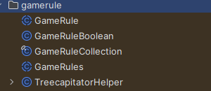

# Using Gamerules in Minecraft

### Why use gamerules?

Gamerules provide a simple, accessible way to add configurable options that players can change directly in-game. They have several advantages:

* Easily modifiable via command line or chat commands.
* Automatically saved in the world’s save data, so changes persist between sessions.
* Allow players to customize world behavior without editing external files.

### Creating a custom gamerule

Minecraft provides different gamerule types in the package `net.minecraft.core.data.gamerule`.

For example, to create a boolean gamerule:

```java
public static GameRuleBoolean MY_GAMERULE = null;

static {
    // Register the gamerule with a unique name and a default value (true here)
    MY_GAMERULE = GameRules.register(new GameRuleBoolean("myGameruleName", true));
}
```

### Types of gamerules available

* Boolean (`GameRuleBoolean`) — for toggling options on or off.
* Integer (`GameRuleInteger`) — for numeric values.
* Float (`GameRuleFloat`) — for decimal values.
* Other types depending on Minecraft version and use case.

